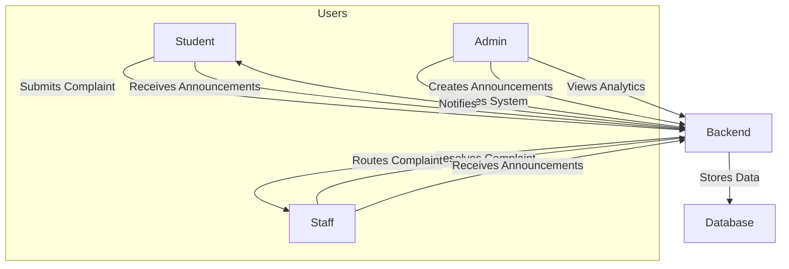
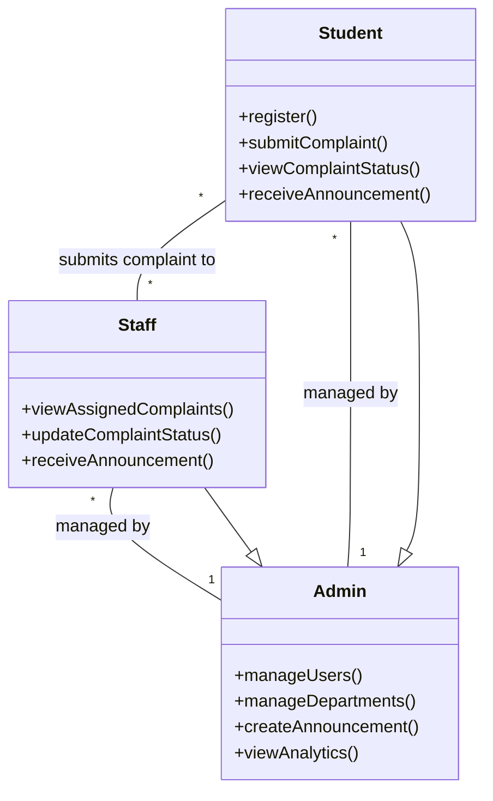

# ASTU Complaint Management System

## Project Overview

The ASTU Complaint Management System is a robust web platform for Adama Science and Technology University. It streamlines the process of submitting, tracking, and resolving university complaints, with AI-powered identity verification and real-time analytics. The system supports three main user roles: Student, Staff, and Admin.

---

## Key Features

- **AI-based Student Registration:** Students register by uploading their university ID card. The system uses OCR to verify the name and ID.
- **Complaint Submission & Tracking:** Students can submit complaints and monitor their status.
- **Departmental Routing:** Complaints are routed to the appropriate staff based on department.
- **Staff Dashboard:** Staff can view, process, and resolve complaints assigned to their department.
- **Admin Dashboard:** Admins manage users, departments, complaints, and announcements, and view analytics.
- **Announcements:** Admins can broadcast announcements to all users.
- **Role-based Access:** Secure login and access control for all user types.

---

## System Architecture

```
Frontend (React + Vite + Tailwind)
    |
    |  REST API (HTTP, JSON)
    v
Backend (Node.js + Express)
    |
    |  Mongoose ODM
    v
MongoDB (Database)
```

### Architecture Diagram



---

## Use Cases

### Student

- Register with ID card (OCR verification)
- Submit complaints (academic, facility, etc.)
- Track complaint status
- Receive announcements

### Staff

- Receive complaints routed to their department
- Update complaint status (in progress, resolved, etc.)
- Communicate with students if needed
- Receive announcements

### Admin

- Manage users (approve, remove, assign roles)
- Manage departments and staff
- Create and send announcements
- View analytics and system logs

---

## Relationship Diagram: Student, Staff, Admin



---

## Technologies Used

- **Frontend:** React, Vite, TypeScript, Tailwind CSS, shadcn-ui
- **Backend:** Node.js, Express, Mongoose, Tesseract.js (OCR)
- **Database:** MongoDB

---

## Getting Started

1. **Clone the repository**
2. **Install dependencies**
   - Frontend: `npm install` in the `Frontend` folder
   - Backend: `npm install` in the `server` folder
3. **Start the servers**
   - Frontend: `npm run dev` (http://localhost:8081)
   - Backend: `npm start` (http://localhost:5000)
4. **Register as a student** or login as staff/admin (see below)

---

## Default Accounts

- **Admin**
  - Email: `admin@astu.edu.et`
  - Password: `Admin@1234`
- **Staff**
  - Email: `staff1@astu.edu.et` / Password: `Staff@1234` (Dormitory)
  - Email: `staff2@astu.edu.et` / Password: `Staff@5678` (Cafeteria)

---

## Folder Structure

```
Frontend/
  src/
    assets/           # Images, logos, etc.
    components/       # React UI components
    pages/            # Page-level components
    hooks/            # Custom React hooks
    lib/              # Utility libraries
    ...
server/
  models/             # Mongoose models
  routes/             # Express route handlers
  lib/                # OCR and utility code
  ...
```

---

## License

This project is for educational and internal use at Adama Science and Technology University.
